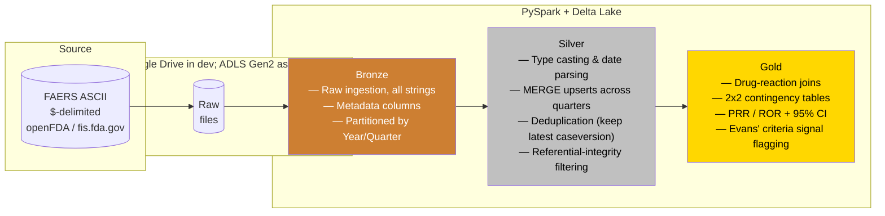

# FAERS Pharmacovigilance Data Pipeline

[](https://spark.apache.org/)
[](https://delta.io/)
[](https://azure.microsoft.com/en-us/products/databricks)
[](LICENSE)

This is an end-to-end data engineering pipeline that ingests, deduplicates, validates, and analyzes **FDA Adverse Event Reporting System (FAERS)** data.  This is the database the FDA uses to monitor drug safety after medications reach the market. Built with PySpark and Delta Lake on a Bronze/Silver/Gold architecture, it processes **767K+ deduplicated adverse event reports** and runs PRR/ROR disproportionality analysis that replicates the FDA's spontaneous-reporting signal detection methodology.

The pipeline processes the **seven FAERS tables** (DEMO, DRUG, REAC, OUTC, RPSR, THER, INDI) for **2024 Q1 + Q2**, and cross-quarter deduplication is handled with idempotent Delta Lake MERGE upserts.

## Architecture



> **Note on infrastructure:** The pipeline was developed and run on Google Colab with Delta tables stored in Google Drive. Azure resources (ADLS Gen2 storage account, Databricks workspace) are provisioned as the deployment target, and the shared `SparkSession` helper auto-detects Databricks vs. a local Delta-configured Spark so the same code runs in either environment.

## Pipeline Metrics (2024 Q1 + Q2)

| Metric | Value |
|--------|-------|
| Raw rows ingested (7 tables × 2 quarters) | ~11.6M |
| Case reports ingested — DEMO (Bronze) | 803,303 |
| Case reports after deduplication (Silver) | 767,774 |
| Duplicate cases removed by MERGE | 35,529 |
| Drug-event pairs evaluated (Gold) | 586,375 |
| Safety signals flagged using Evans' criteria | 85,230 (14.5% signal rate) |
| Known signals validated | 7 / 7 detected |
| Data quality checks | 28 PASS, 1 WARN, 1 FAIL (expected) |

The single expected FAIL is `null_event_dt` on DEMO (~55% null), which is a known characteristic of FAERS reports, where the event date is frequently unreported. The WARN is `null_age` (~40% null), tracked but non-blocking.

## Key Features

| Feature | What It Demonstrates |
|---------|---------------------|
| **Delta Lake MERGE** | Idempotent upserts — match on `caseid`, update if newer `caseversion`, insert if new. Re-running never creates duplicates. Source rows are pre-deduplicated to prevent `DELTA_MULTIPLE_SOURCE_ROW_MATCHING`. |
| **PRR/ROR Signal Detection** | 2×2 contingency tables with Evans' criteria (PRR ≥ 2, χ² ≥ 4, N ≥ 3). Chi-square uses Yates' correction; ROR is reported with 95% confidence intervals. |
| **Data Quality Framework** | Null checks, referential integrity, domain validation, range checks, and duplicate detection — persisted as a Gold Delta table for historical, timestamped tracking. |
| **Medallion Architecture** | Bronze (raw + metadata), Silver (typed, deduped, integrity-filtered), Gold (analytics-ready signals). Every layer is a Delta table with full ACID transactions.

## Signal Detection Results

The pipeline validated all seven tested known pharmacovigilance signals:

| Drug | Adverse Event | Reports (N) | PRR | ROR | χ² | Signal? |
|------|---------------|-------------|-----|-----|-----|---------|
| Metformin | Lactic Acidosis | 574 | 269.57 | 376.33 | 89,800.25 | Yes |
| Warfarin | Haemorrhage | 5 | 8.90 | 9.25 | 27.72 | Yes |
| Methotrexate | Pancytopenia | 235 | 19.96 | 21.01 | 3,779.96 | Yes |
| Isotretinoin | Depression | 26 | 10.83 | 11.83 | 223.39 | Yes |
| Infliximab | Tuberculosis | 18 | 20.24 | 20.51 | 300.28 | Yes |
| Simvastatin | Rhabdomyolysis | 38 | 99.73 | 119.17 | 3,516.74 | Yes |
| Atorvastatin | Rhabdomyolysis | 130 | 43.40 | 46.42 | 4,817.99 | Yes |

## Tech Stack

- **Development / runtime:** Google Colab (PySpark 3.5.0, Delta Lake / delta-spark 3.2.0)
- **Cloud target:** Azure — ADLS Gen2 storage account and Databricks workspace provisioned
- **Storage format:** Delta Lake (ACID transactions, time travel, schema evolution)
- **Analytics:** PRR, ROR, Chi-square with Yates' correction, 95% confidence intervals
- **Data quality:** PySpark-native validation framework persisted as a Delta table
- **Validation:** Reproduced 7 established drug-safety signals from the literature
- **Dependencies:** `pyspark`, `delta-spark`, `requests` (see `requirements.txt`)

## Repository Structure

```
FAERSDataPipeline/
├── README.md
├── .gitignore
├── requirements.txt
├── LICENSE
├── notebooks/                        # Run in the order below
│   ├── DownloadingDataset.ipynb      # Fetch FAERS quarters, explore raw data, write samples
│   ├── BronzePipeline.ipynb          # Raw ASCII → Bronze Delta (all strings + metadata)
│   ├── SilverPipeline.ipynb          # Type casting, date parsing, MERGE dedup, integrity filtering
│   ├── DataQuality.ipynb             # 30 DQ checks against Silver tables
│   └── GoldPipeline.ipynb            # Drug-event pairs, PRR/ROR, signal flagging
├── src/
│   ├── ingestion/
│   │   ├── download_faers.py         # openFDA manifest download utilities
│   │   └── bronze_ingestion.py       # read_faers_raw, ingest_to_bronze, ingest_quarter_to_bronze
│   ├── transformations/
│   │   ├── silver_transforms.py      # Per-table typing/parsing + filter_to_valid_ids
│   │   ├── deduplication.py          # merge_demo_silver, merge_child_table (Delta MERGE)
│   │   └── signal_detection.py       # build_drug_event_pairs, compute_disproportionality
│   └── utils/
│       ├── spark_session.py          # Environment-agnostic SparkSession (Databricks or local)
│       └── data_quality.py           # run_faers_dq_checks validation framework
├── data/
│   └── sample/                       # Placeholder (.gitkeep); sample .txt extracts are
│                                     #   generated by DownloadingDataset.ipynb and gitignored
├── docs/
│   └── data_dictionary.md            # FAERS field reference
└── config/
    └── pipeline_config.json          # Quarters, file types, paths, signal thresholds
```

## How It Works

Run the notebooks sequentially:

1. **DownloadingDataset** — pulls the target FAERS quarters, explores the raw `$`-delimited files, and writes small `*_SAMPLE.txt` extracts.
2. **BronzePipeline** — loads each raw file into a Delta table with no cleaning; every value stays a string, plus ingestion metadata, partitioned by year/quarter.
3. **SilverPipeline** — casts columns to real types, parses dates, standardizes text, drops unusable rows, filters child tables to valid `primaryid`s, and MERGE-upserts DEMO across quarters keeping only the highest `caseversion` per case.
4. **DataQuality** — runs null, range, domain, referential-integrity, and duplicate checks against the Silver tables and persists results as a Delta table.
5. **GoldPipeline** — joins drugs to reactions, builds 2×2 contingency tables, computes PRR / ROR / χ² with confidence intervals, and flags signals using Evans' criteria.

## Quick Start

### Run on Google Colab (recommended)
1. Open the notebooks in Colab (or clone this repo into your Drive).
2. Run the setup cell at the top of each notebook (installs PySpark + Delta and mounts Drive).
3. Execute the notebooks in the order above: **DownloadingDataset → BronzePipeline → SilverPipeline → DataQuality → GoldPipeline**.

### Run locally
```bash
git clone https://github.com/stutterk1d/FAERSDataPipeline.git
cd FAERSDataPipeline
python -m venv .venv && source .venv/bin/activate
pip install -r requirements.txt
```
The `src/` modules run locally via the environment-agnostic `get_spark()` helper. Note that the notebooks default to Colab/Google Drive paths (see `config/pipeline_config.json`); to run them locally, point the `raw` / `bronze` / `silver` / `gold` paths at a local directory.

### Configuration
`config/pipeline_config.json` holds the target quarters (`2024Q1`, `2024Q2`), FAERS file types, Colab/Azure storage paths, and signal-detection thresholds (`prr_threshold` 2.0, `chi2_threshold` 4.0, `min_report_count` 3).

### Data Source
The download notebook automates retrieval through the openFDA manifest. FAERS quarterly ASCII files can also be downloaded manually from:
https://fis.fda.gov/extensions/FPD-QDE-FAERS/FPD-QDE-FAERS.html

## License

[MIT](LICENSE) — Ethan Tran